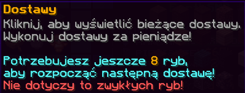

# 🚌 Dostawy

## 💰 Jak zarabiać na dostawach? {#zarabianie}

Za każde **180 złowionych ryb** otrzymujesz jedną 📦 **Dostawę**.

Po złowieniu odpowiedniej liczby ryb, na czacie pojawi się komunikat informujący o nowej dostawie.  
Możesz również sprawdzić swój postęp w menu ryb – wystarczy najechać na ikonę dostawy 🐟📦

---

## ⚙️ Jak działają dostawy? {#dzialanie}

Mechanika dostaw jest prosta, a nagrody bardzo opłacalne! ✨

1. 🎣 Złów **180 ryb**, aby odblokować nową dostawę
2. 🐟 Zdobądź wymaganą ilość określonych ryb
3. 📦 Kliknij dostawę, aby ją rozpocząć (ryby zostaną zabrane)
4. ⏳ Odczekaj wymagany czas
5. 🎁 Odbierz swoją nagrodę z menu dostawy

---

## 🛠️ Ulepszenia dostaw {#ulepszenia}

Możesz rozwinąć pięć **specjalnych ulepszeń**, które ułatwią realizację dostaw i zwiększą zyski:

| 🧪 Ulepszenie                 | ✍️ Opis                                                       |
| ----------------------------- | ------------------------------------------------------------- |
| 🧺 **Zwiększona pojemność**   | Pozwala przechowywać więcej dostaw jednocześnie               |
| ⚡ **Podkręcony**             | Skraca czas potrzebny na realizację dostaw                    |
| 🧠 **Ekspert w dostarczaniu** | Zmniejsza liczbę wymaganych ryb do pojedynczej dostawy        |
| 💸 **Zwiększona płaca**       | Zwiększa ilość 🌌 Entropii otrzymywanej za wykonanie dostawy  |
| 🍀 **Szczęśliwy traf**        | Zmniejsza ilość ryb potrzebnych do odblokowania nowej dostawy |

---

📦 **Dostawy** to idealny sposób na pasywny zysk, szczególnie jeśli lubisz regularnie łowić ryby! Nie zapomnij inwestować w ulepszenia, by wycisnąć z nich maksimum! 🐠💼
