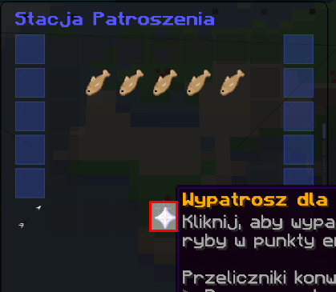
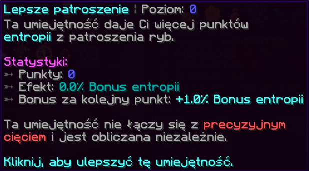

# ⚔️ Stacja Patroszenia

## 🐟 Co to jest patroszenie ryb? {#co-to}

„Patroszenie” to mechanika polegająca na rozkładaniu złowionych ryb w celu uzyskania dodatkowej 🧬 Entropii.

🎣 Choć zarobisz **mniej Entropii** niż za standardowe łowienie, patroszenie to świetna opcja, gdy potrzebujesz jej trochę więcej „na już”.

> 🛑 **Uwaga!** Patroszenie daje wyłącznie Entropię – **nie** otrzymasz żadnych dodatkowych przedmiotów i **nie można cofnąć** tego procesu!

---

## 🛠️ Jak patroszyć ryby? {#jak}

Patroszenie jest bardzo proste:

1. 💬 Użyj komendy:  
   `/fish gut`  
   lub przejdź przez `/fish menu` → **Stacja Patroszenia**
2. 🧺 Umieść ryby w specjalnym menu
3. ✨ Kliknij w **gwiazdę netherową**, aby rozpocząć patroszenie

---

## 💡 Jak zwiększyć zysk z patroszenia? {#wiekszy-zysk}

Obecnie masz **dwa główne sposoby**, by zwiększyć Entropię z patroszenia:

- ✂️ [Precision Cutting](ulepszenia/lista#precision-cutting)
- 🎣 [Lepsze Patroszenie](umiejetnosci#umiejetnosci-ulepszalne) _(umiejętność wędkarza)_

🧠 Te dwa bonusy **nie kumulują się ze sobą**, ale działają niezależnie na podstawowy zysk z patroszenia.

---

### 🔬 Precision Cutting {#precision-cutting}

Ulepszenie, które możesz odblokować dla swojego **Totemu Wędkarskiego**, zwiększające zyski z patroszenia.

---

### 📚 Lepsze Patroszenie {#lepsze-patroszenie}

Umiejętność pasywna, którą możesz rozwijać w swoim drzewku umiejętności.

