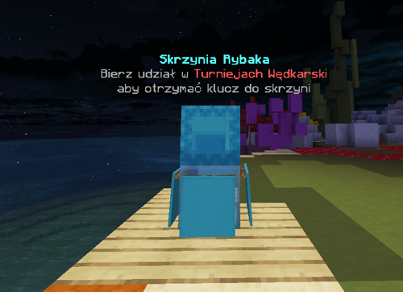
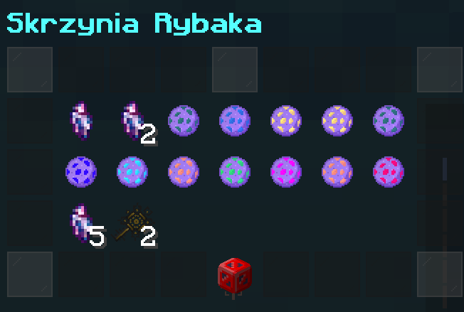

# 🎣 Podstawy Łowienia

<!-- TODO: Cała kategoria łowienie wymaga aktualizacji, zmiana grafik, aktualizacja treści. -->

## 🔹 Łowienie {#lowienie}

Łowienie **niestandardowych ryb** jest łatwe! Wystarczy wrzucić wędkę do zbiornika z wodą i poczekać, aż ryba zacznie brać. 🎣🐟  
Uważaj na wędki z ulepszeniami, które zwiększają szansę na złapanie wyjątkowych ryb!

---

## 🛍️ Sprzedaż Ryb {#sprzedaz}

Sprzedaż ryb jest bardzo prosta! Po prostu użyj komendy `/fish shop` i sprzedaj swoje ryby, aby zdobyć pieniądze 💸.

---

## 🔮 Entropia {#entropia}

Informacje o **entropii** możesz uzyskać [tutaj](entropia) 🌌  
Entropia odgrywa ważną rolę w tworzeniu ulepszeń i zdobywaniu specjalnych przedmiotów!

---

## 📈 Poziom łowienia {#poziom}

Twój poziom łowienia jest bardzo ważny! Możesz zdobywać **XP** za łapanie niestandardowych ryb. Poniżej znajduje się tabela z domyślnym XP dla każdej ryby:

| 🏅 Poziom     | XP   |
| ------------- | ---- |
| 🟤 Brązowe    | 75   |
| ⚪ Srebrne    | 150  |
| 🟡 Złote      | 300  |
| 💎 Diamentowe | 700  |
| 🔱 Platynowe  | 1900 |
| 🌟 Mityczne   | 6000 |

Twój poziom połowu wpływa na różne aspekty gry, takie jak:

- Możliwość tworzenia **ulepszeń** (różnią się w zależności od ulepszeń).
- Odblokowanie i zbudowanie **totemu wędkarskiego** (Wymagany poziom 20).
- Zdobywanie **punktów umiejętności** oraz ulepszanie/odblokowywanie [umiejętności](umiejetnosci) (1 punkt za możliwość ulepszenia, 15 za jednorazowe odblokowanie).

---

## ⚡ Jak zdobywać więcej XP? {#jak-zdobywac-wiecej-xp}

Istnieje kilka sposobów, aby zwiększyć przyrost XP:

- [**Ulepszenie Sage**](ulepszenia/lista#sage) — zwiększa zdobywane XP.
- [**Ulepszenie w totemie "Doświadczony rybak"**](totemy#ulepszenia) — dodatkowy bonus do XP.

Możesz sprawdzić swój poziom w dowolnym momencie, korzystając z komendy `/fish stats`. 📊

---

## 🦀 Kraby {#kraby}

Kraby to niestandardowe stwory, z których można uzyskać unikalne przedmioty. Oto, co można zdobyć:

| 🪶 Przedmiot         | 🔑 Jak to zdobyć            |
| -------------------- | --------------------------- |
| 🦵 Pazur Kraba       | Zabijając Kraba (20%)       |
| 🦀 Łuska Kraba       | Zabijając Kraba (20%)       |
| 🐬 Ogon Delfina      | Zabijając Delfina (80%)     |
| 🦑 Macka kałamarnicy | Zabijając Kałamarnice (10%) |

---

## 👥 Wspólne wędkowanie {#wspolne-wedkowanie}

Jeśli 2-4 gracze zbiorą się na jednym łowisku, aktywowany zostanie **booster** za wspólne wędkowanie! 🚀 To świetna okazja, by złapać więcej ryb i zdobyć dodatkowe bonusy!

---

## 🎒 Plecak Wędkarza {#plecak}

Plecak wędkarza to specjalne miejsce do przechowywania ryb. Możesz zostawić je w plecaku, aby później oddać je do [**dostaw**](dostawy). Aby otworzyć plecak, użyj komendy `/fish bag`. 🐠

---

## 📦 Skrzynia Rybaka {#skrzynia}

Na serwerze znajduje się **Skrzynia Rybaka**, w której możesz zdobywać ulepszenia, entropię i klucze. Aby ją znaleźć, użyj komendy `/spawn` i idź w stronę skrzyni:

### 🗝️ Jak zdobyć klucz? {#klucz}

Masz dwa sposoby:

1. **W strefie AFK** (`/warp strefa-afk`) znajdziesz skrzynię z kluczem. 🔑
2. [**Turnieje**](turnieje) - pierwsza osoba wygrywa klucz rybaka.

---

🎣 Gotowy na łowienie? Powodzenia, ryby czekają! 🐟
