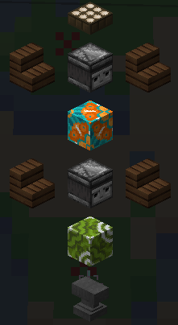

# 🗼 Totemy Wędkarskie

## 🎣 Jak zdobyć Totem Wędkarski? {#jak-zdobyc}

Zdobycie Totemu Wędkarskiego jest proste – wystarczy zbudować strukturę i zebrać odpowiednie przedmioty.

### 🧾 Wymagane przedmioty {#przedmioty}

- 🐬 16 [Ogonów Delfina](podstawy#-kraby)
- 🦀 16 [Pazurów Kraba](podstawy#-kraby)
- 🐚 16 [Łusek Kraba](podstawy#-kraby)
- 🦑 16 [Macek Kałamarnicy](podstawy#-kraby)
- 🐟 6 dowolnych **platynowych ryb**

:::danger Wymagany poziom
Aby aktywować Totem, potrzebujesz **20 poziomu wędkarstwa**. Możesz to sprawdzić komendą `/fish stats`.
:::

---

## ⚙️ Jak aktywować Totem? {#aktywacja}

Gdy masz wszystkie materiały i wymagany poziom:

1. 🔨 Zbuduj strukturę totemu (przewodnik znajdziesz w `/fish menu`).
2. 📸 Możesz też skorzystać z poniższego obrazka:

3. 🪝 Uderz dolnego **obserwera** wędką – Totem powinien się aktywować (lub wyświetlić komunikat o błędzie, jeśli czegoś brakuje).

:::info
Kierunek schodków **nie ma znaczenia** – mogą być ustawione w dowolną stronę.
:::

---

## ✨ Co robi aktywowany Totem? {#co-robi}

Totem daje różne korzyści i efekty. Niektóre z nich wymagają ulepszeń za Entropię, inne zaś odpowiedniego poziomu połowu i pasywnych slotów.

---

## 🧪 Ulepszenia Totemu (Entropia) {#ulepszenia}

Totem można ulepszyć za pomocą Entropii – każde ulepszenie zwiększa jego skuteczność:

| 🔧 Ulepszenie      | 💰 Koszt początkowy | ➕ Dodatkowy koszt | 🔝 Maks. poziom | 💡 Co robi?                                   |
| ------------------ | ------------------- | ------------------ | --------------- | --------------------------------------------- |
| 📏 Zasięg          | 115 000             | 62 500             | 30 bloków       | Zwiększa promień działania Totemu.            |
| ⏱️ Czas odnowienia | 120 000             | 100 000            | 30 minut        | Skraca czas odnowienia z domyślnych 60 minut. |
| 🕒 Aktywny czas    | 90 000              | 100 000            | 30 minut        | Wydłuża czas działania wzmocnień.             |

📐 **Wzór na koszt ulepszenia:**  
`Koszt początkowy + (poziom × koszt dodatkowy)`

**Przykład:** Ulepszenie zasięgu do poziomu 5:  
`115 000 + (62 500 × 5) = 427 500 Entropii`

:::info
Zwiększaj promień tylko wtedy, gdy totem ma obejmować większy obszar, np. jezioro. Wystarczy, że **Ty stoisz w zasięgu** – spławik może być poza nim.
:::

---

## 🧩 Sloty pasywne {#sloty-pasywne}

Pasywne sloty są potrzebne do aktywowania pasywnych ulepszeń Totemu.

| 🎣 Ryba      | 🔢 Ilość |
| ------------ | -------- |
| 🐟 Platynowa | x5       |
| 🐠 Mityczna  | x1       |

📈 Koszt rośnie z każdym kolejnym slotem.  
**Przykład (3. slot):**

- 15x Platynowych ryb
- 3x Mityczne ryby

:::danger Uwaga!
Ryby muszą być tego **samego rodzaju** – nie można mieszać mitycznych i platynowych!
:::

---

## 💎 Pasywne ulepszenia Totemu {#pasywne-ulepszenia}

Ulepszenia te są **oddzielne** od ulepszeń Entropii – wymagają odpowiedniego poziomu wędkarstwa i dostępnych slotów.

:::info
🎯 Aby efekty działały, **musisz stać w promieniu Totemu** (zielony okrąg). Spławik może być poza nim.

🔄 Ulepszenia możesz włączać/wyłączać nawet podczas działania Totemu.
:::

| 🧠 Ulepszenie          | 🎣 Poziom | 🔳 Sloty | 🧾 Opis działania                                                |
| ---------------------- | --------- | -------- | ---------------------------------------------------------------- |
| 📘 Doświadczony Rybak  | 20        | 1        | Zwiększa ilość zdobywanego doświadczenia podczas łowienia.       |
| 🦀 Małe Stworzenia     | 40        | 2        | Zwiększa szansę na łupy związane z krabami.                      |
| 🐠 Szkoła Rybna        | 40        | 3        | Sprawia, że ulepszenie "Gorący Punkt" aktywuje się częściej.     |
| 🎁 Losowe Krople       | 55        | 4        | Szansa na dodatkowe łupy (np. Macki, Ogony) za zabijanie krabów. |
| 💰 Poszukiwacz Skarbów | 60        | 5        | 1% szansy na znalezienie rzadkich przedmiotów podczas łowienia.  |
| 🧬 Mityczne Wody       | 60        | 5        | 20% szansy na ulepszenie złowionej ryby do wyższej rzadkości.    |
| 🌌 Horyzont Entropii   | 60        | 6        | Zwiększa ilość zdobywanej Entropii o 1.25x.                      |
| ⭐ Upadek Gwiazdy      | 100       | 10       | 🔒 Obecnie wyłączone.                                            |

---
