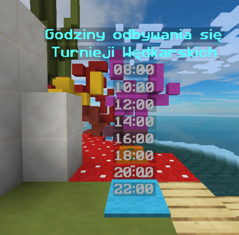

# 🎖 Turnieje

## Czym są turnieje?

Turnieje jest to najszybszy sposób na zdobycie pieniędzy lub ulepszeń. Na serwerze mamy 8 turnieji dziennych.

Aby brać udział w takim turnieju potrzebujesz tylko wędki!!!

Gdy zobaczysz na czacie komunikat o rozpoczęciu się turnieju zabierz wędkę i łów.

[tutaj ss narazie nie mam]

Podczas turnieju mamy 10 minut aby złowić najwięcej, najmniejsze, największe ryby. Gdy skonczy się czas pokaże się tabela z winikiem wygranych. Mamy
3 miejsca za którę dostaniesz poszczególne nagrody:

1. 10,000$ i 1 [klucz rybaka](/earthsmp/lowienie/podstawy#skrzynia-rybaka)
2. 6,500$
3. 2,500$
4. Reszta graczy 1,500 Entropii

## Jakie są rodzaje turniejów?

Na serwerze mamy 7 rodzajów turniejów takich jak:

| Nazwa             | Opis                                                                     |
| ----------------- | ------------------------------------------------------------------------ |
| RandomCatchFish   | Złów najwięcej ryb wymienionych w turnieju.                              |
| CrabKilling       | Zabijaj najwięcej krabów.                                                |
| LongestCast       | Złów najdłuższą rybę.                                                    |
| BaseEntropyEarned | Złów i zarób najwięcej entropi. (Patroszenie nie wlicza się do turnieju) |
| LongestLength     | Złów najdłuższą rybę.                                                    |
| ShortestLength    | Złów najkrótszą rybę.                                                    |
| MostCatch         | Złap najwięcej ryb.                                                      |
| MostBiomes        | Złów ryby na największej ilości biomów.                                  |
