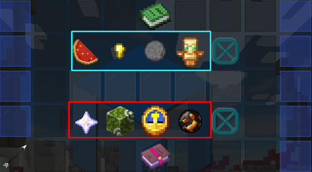

# 🎇 Umiejętności

**Ta strona zawiera informacje o różnych umiejętnościach wędkarskich dostępnych w `/fish skills`.**

## 🤔 Czym są umiejętności? {#czym-sa}

Na **MineCube** dostępnych jest 10 różnych umiejętności, które możesz ulepszać. Aby ulepszyć umiejętności, potrzebujesz punktów umiejętności. Za każdym razem, gdy zdobywasz kolejny poziom w łowieniu, zdobywasz **jeden punkt umiejętności**. 💡

## Rodzaje umiejętności {#rodzaje}

Obecnie istnieją dwa różne typy umiejętności, a każda z nich ma inny wpływ:

### 🔧 Ulepszenia Umiejętności {#ulepszenia}

Obecnie dostępnych jest 10 umiejętności, które można ulepszyć. 👇

### 🛒 Umiejętności Zakupu Jednorazowego {#umiejetnosci-jednorazowe}

Umiejętności te działają raczej jako efekty „pasywne” niż jako aktywne umiejętności. Ich zakup kosztuje stałą liczbę punktów umiejętności (zwykle **10**). Po zakupie umiejętność ta będzie zawsze aktywna.

Te umiejętności skalują się wraz z Twoim poziomem łowienia. Oznacza to, że im wyższy poziom wędkowania posiadasz, tym lepiej będą się sprawować te umiejętności. 🌱

Aby zmaksymalizować wykorzystanie tych umiejętności - spróbuj zdobyć jak najwięcej poziomów! 🚀

## 🏆 Jakie umiejętności ustnieją? {#umiejetnosci}

### Umiejętności, które można ulepszać: {#umiejetnosci-ulepszalne}

| 📝 Nazwa                  | 💬 Opis                                                |
| ------------------------- | ------------------------------------------------------ |
| 🎣 **Lepsze patroszenie** | Daje Ci więcej punktów **entropii** z patroszenia ryb. |
| 🍀 **Szczęście połowu**   | Daje więcej punktów **entropii** od połowu ryb.        |
| 🛠 **Mistrz ulepszeń**     | Obniża koszty tworzenia ulepszeń wędkarskich.          |
| ⏳ **Lider totemu**       | Zmniejsza czas odnowienia totemu podczas łowienia ryb. |

### Umiejętności, które można kupić jednorazowo: {#umiejetnosci-jednorazowe}

| 📝 Nazwa                    | 💬 Opis                                                                                                                                            |
| --------------------------- | -------------------------------------------------------------------------------------------------------------------------------------------------- |
| ⚡ **Boski sąd**            | Daje szansę na przywołanie boskiego urzędzenia, które powoduje **tsunami**. Wędkowanie w tsunami podwaja liczbę ryb złapanych w jego promieniu. 🌊 |
| 🗣 **Plemienny krzyk**       | Daje graczom w pobliżu Twojego totemu rybackiego procent z całkowitych efektów. 🐟                                                                 |
| 💥 **Combo rybak**          | Zwiększa Twoje szanse na złapanie rzadszych ryb. Im wyższy poziom umiejętności, tym wyższa możliwa kombinacja osiągnięć. 🔝                        |
| 🧪 **Wzbogacająca infuzja** | Ma szansę na zwrot kosztów używanych w tworzeniu ulepszeń. 🔄                                                                                      |
